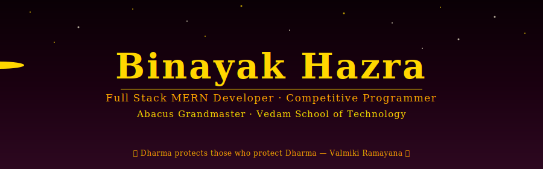
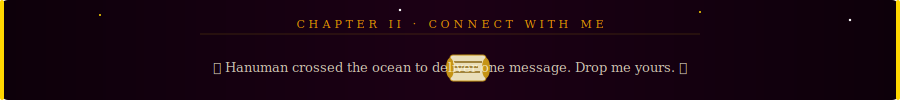

<!-- ============================================================ -->
<!--         BINAYAK HAZRA — RAMAYANA THEMED GITHUB PROFILE       -->
<!-- All SVG animations are in the /assets folder of this repo    -->
<!-- ============================================================ -->

<div align="center">

<!-- ═══════════════════════════════════════════════ -->
<!--   ANIMATED HEADER — Flying Arrow Reveals Name   -->
<!-- ═══════════════════════════════════════════════ -->



</div>

---

<div align="center">



</div>

```yaml
Name         : Binayak Hazra
Role         : Full Stack MERN Developer
Institute    : Vedam School of Technology
Achievement  : Academic Topper 🏆
Craft        : Abacus Grandmaster 🧮
Arena        : Competitive Programmer ⚔️
Spirit       : Open Source Contributor 🌍
```

---

<div align="center">


</div>

<div align="center">

<!-- ══════════════════════════════════════ -->
<!--   CHAPTER II — ARROWS FLY ACROSS     -->
<!-- ══════════════════════════════════════ -->


</div>


---

<div align="center">


<!-- ════════════════════════════════════════════════ -->
<!--   CHAPTER III — HANUMAN FLYING ACROSS           -->
<!-- ════════════════════════════════════════════════ -->


</div>

<div align="center">

| 🎖️ Honor | 📌 Details |
|:---|:---|
| 🥇 **Academic Topper** | Vedam School of Technology — Ranked #1 |
| 🧮 **Abacus Grandmaster** | Highest rank in Mental Mathematics |
| ⚔️ **Competitive Programmer** | Codeforces Active — **1007 Rating** |
| 💻 **Full Stack Developer** | End-to-end MERN application builder |

</div>

---

### 🧮 Abacus — Grandmaster

> *"Where Hanuman could leap across oceans in a heartbeat,*
> *I solve thousands of calculations — in a single flash of the mind."*

```
  Level      : G R A N D M A S T E R
  Domain     : Mental Arithmetic · Speed Calculation · Flash Anzan
  Superpower : Visualizing the answer before fingers touch the keys
```

---

### ⚔️ Competitive Problem Solving

> *"Vali could challenge a thousand warriors.*
> *I challenge a thousand problems — and I keep going."*

<div align="center">

[](https://codeforces.com/profile/BINAYAK_HAZRA)

**Current Rating : 1007** &nbsp;|&nbsp; Climbing steadily — one problem at a time 🚀

</div>

```
  Platform   : Codeforces
  Rating     : 1007 (and rising)
  Domains    : Algorithms · Data Structures · Dynamic Programming · Math
  Goal       : Reach Expert (1400+) — The Battle Continues
```

---

<div align="center">


<!-- ══════════════════════════════════════════════════ -->
<!--   CHAPTER IV — RAM SETU BRIDGE BUILDS STONE BY STONE -->
<!-- ══════════════════════════════════════════════════ -->


</div>

### 🏗️ Building Real-World Projects

```
  ⚒️  Build production-ready applications that solve real problems
  ⚒️  Collaborate with talented developers from across the globe
  ⚒️  Ship innovative, scalable, and impactful software
  ⚒️  Bridge ideas with clean, elegant, maintainable code
```

---

### 🌍 Open Source Contribution

> *"Like Hanuman who served without seeking reward —*
> *I contribute to open source, purely for the community."*

```
  🕊️  Actively contribute to open source repositories
  🕊️  Raise pull requests · Review code · Help fellow developers grow
  🕊️  Believe in building in public and learning in public
  🕊️  Every contribution is an act of giving back
```

---

<div align="center">


<!-- ═══════════════════════════════════════════════════════ -->
<!--   CHAPTER V — FLYING SCROLL (HANUMAN'S MESSAGE)        -->
<!-- ═══════════════════════════════════════════════════════ -->



</div>

<div align="center">

[](https://www.linkedin.com/in/binayakhazra1)
[](mailto:binayak.hazra2029@vedamsot.org)

| Platform | Handle |
|:---|:---|
| 💼 **LinkedIn** | [linkedin.com/in/binayakhazra1](https://www.linkedin.com/in/binayakhazra1) |
| 📧 **Email** | binayak.hazra2029@vedamsot.org |

*Open to collaborations, project discussions, and open source contributions.*

</div>

---

<div align="center">


<!-- ════════════════════════════════════════════════ -->
<!--   CLOSING — 7 DIYAS BURNING, JAI SHRI RAM      -->
<!-- ════════════════════════════════════════════════ -->


</div>